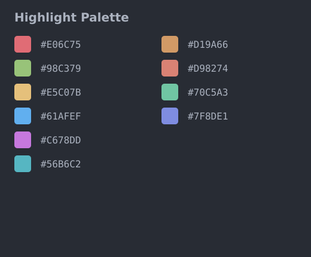

# Text Marker Plus

This is an independently maintained distribution derived from
[ryu1kn/vscode-text-marker](https://github.com/ryu1kn/vscode-text-marker).
It is a community-maintained continuation branch: it preserves the original
Text Marker behavior while adding configurable save targets, optional automatic
saving after **Toggle Highlight**, and ongoing compatibility and performance
fixes.

And the extention can be installed from the the [market](https://marketplace.visualstudio.com/items?itemName=Williamslay.text-marker-Plus).

## Differences from Upstream

This distribution is maintained independently from the upstream project. It
currently differs from the original plugin in these areas:

- Full-document matching runs in a dedicated worker instead of blocking the
  VS Code Extension Host.
- Completed full-document matches are cached by document version, highlight
  rule, and match range, reducing repeated scanning during refreshes while
  stale asynchronous results are discarded safely.
- Highlights refresh in every currently **visible** editor pane, including split
  panes that do not have focus. Tabs that are open but not visible refresh when
  they become visible.
- Added `textmarker.defaultSaveTarget` with Workspace, Global, and Prompt
  save modes.
- Added optional `textmarker.autoSaveOnToggle` persistence.
- Added optional user-defined highlight colors through `textmarker.userColor`
  and `textmarker.useUserColor`.
- Uses the One Half Dark accent palette by default.
- Removed the upstream plugin's telemetry functionality. This extension **does not collect any information**.

<p align="left">
  
</p>

> **Normal runtime behavior:** The visible editor region is highlighted first,
> while matches elsewhere are completed asynchronously in the background.

<p align="left">
  
</p>

> [!NOTE]
> **Staged rendering demonstration**
>
> This GIF was recorded with an intentional **5-second delay** inserted before
> background full-document matching. The delay exists only to make the staged
> rendering behavior clearly visible.
>
> Please compare:
>
> - highlights inside the currently visible editor area;
> - highlights shown elsewhere in the sidebar or overview ruler.
>
> The visible editor area is highlighted first. Highlights outside the current
> area appear after asynchronous background matching completes.
>
> The 5-second delay is **not part of normal runtime behavior**. This GIF
> demonstrates progressive rendering order, not production matching latency.

## Features

- Highlight or unhighlight selected text, or the word under the cursor.
- Highlight every matching occurrence in the current editor.
- Highlight text using regular expressions.
- Toggle case-sensitive or case-insensitive matching.
- Toggle whole-word or partial matching.
- Update existing highlight rules.
- Jump to the next or previous occurrence of the same highlight rule.
- Configure highlight colors, opacity, ruler colors, and status-bar buttons.
- Save highlights and restore them when an editor opens, and can choose the saving place.
- Optionally save all highlights whenever **Toggle Highlight** adds or removes
  a rule.

## Commands

| Command | Command ID |
| --- | --- |
| Highlight Text Using Regex | `textmarker.highlightUsingRegex` |
| Toggle Highlight | `textmarker.toggleHighlight` |
| Unhighlight Text | `textmarker.unhighlight` |
| Update Highlight | `textmarker.updateHighlight` |
| Go to Next Same Highlight | `textmarker.goToNextHighlight` |
| Go to Previous Same Highlight | `textmarker.goToPreviousHighlight` |
| Clear All Highlights | `textmarker.clearAllHighlight` |
| Save All Highlights | `textmarker.saveAllHighlights` |
| Toggle Case Sensitivity | `textmarker.toggleCaseSensitivity` |
| Toggle Mode for Case Sensitivity | `textmarker.toggleModeForCaseSensitivity` |
| Toggle Whole/Partial Match | `textmarker.toggleWholeMatch` |
| Toggle Mode for Whole/Partial Match | `textmarker.toggleModeForWholeMatch` |

`Toggle Highlight`, `Update Highlight`, and next/previous navigation are also
available from the editor context menu where configured.

## Save Behavior

Saved rules are stored in `textmarker.savedHighlights`.

`textmarker.defaultSaveTarget` controls where **Save All Highlights** writes:

- `workspace` (default): current Workspace settings.
- `global`: User/Global settings.
- `prompt`: show the original Workspace/Global selection prompt.

If `workspace` is selected while no Workspace is open, the extension falls
back to the selection prompt instead of silently writing to Global settings.
This also works with multi-root Workspaces.

Set `textmarker.autoSaveOnToggle` to `true` to combine toggling and saving:

```json
{
  "textmarker.defaultSaveTarget": "workspace",
  "textmarker.autoSaveOnToggle": true
}
```

With this configuration, running `textmarker.toggleHighlight` updates the
visual highlight and immediately saves all current rules to Workspace settings.
Set `defaultSaveTarget` to `global` or `prompt` for different save behavior.

## Other Settings

- `textmarker.highlightColors`: colors assigned to new highlights.
- `textmarker.userColor`: user-defined colors that extend the default highlight
  palette when `textmarker.useUserColor` is enabled. Despite its singular name,
  this setting accepts an array.
- `textmarker.useUserColor`: when `true`, adds `textmarker.userColor` values to
  the highlight color cycle. When `false`, configured user colors are ignored.
- `textmarker.defaultHighlightOpacity`: opacity from `0` to `1`.

The default highlight palette follows the [One Half Dark](https://github.com/sonph/onehalf) accent colors, with several additional colors:



When `textmarker.useUserColor` is enabled, colors from `textmarker.userColor`
are assigned after these colors. When the combined color set is exhausted,
assignment starts again from its first color. The default user-color array is
empty.

- `textmarker.enableIgnoreCase`: initial case-insensitive mode.
- `textmarker.enableWholeMatch`: initial whole-match mode.
- `textmarker.useHighlightColorOnRuler`: use highlight colors on the ruler.
- `textmarker.autoSelectDistinctiveTextColor`: choose contrasting text color.
- `textmarker.hideStatusBarItems`: hide matching-mode status-bar controls.
- `textmarker.commandsOnContextMenu`: control commands shown in the context
  menu.

## Development

Use Node.js `22.23.0` and Yarn:

```sh
yarn install --frozen-lockfile
yarn run check
```

Focused commands:

```sh
yarn run unit-test -- --grep "pattern"
yarn run acceptance-test
yarn run compile
```

## License

MIT License. The original copyright and license notice are retained in
[LICENSE.txt](./LICENSE.txt).
